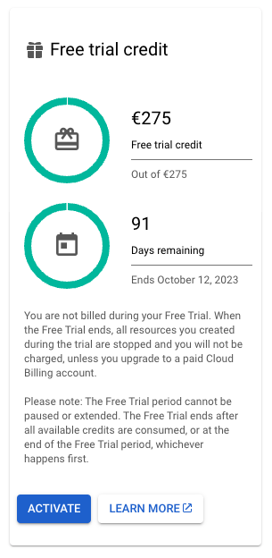
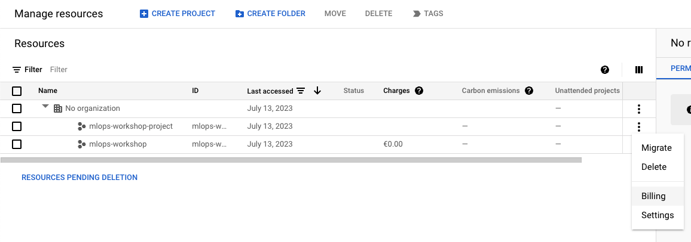

# Deploy container on GCP 🚀

## 1. Deploy using the UI 🖥️

1. Go to the [GCP console](https://console.cloud.google.com/) and login or create an account.

2. Create a new project (e.g. `mlops-tutorial`).
3. Activate your trial to get 275$ for free. If you can't find the option, you can navigate to the [resource manager](https://console.cloud.google.com/cloud-resource-manager) where you can select "Billing" from the options next to your project name. Set up your billing account and activate your trial.



4. Now navigate to Cloud Run from the top menu
5. Click on "Create Service"
6. Configure the service:
   - Fill in the Container image URL (e.g. `docker.io/<your-dockerhub-username>/turbine-image:latest`).
   - Choose a name for your app (e.g. `turbine-app`).
   - Set the region to `europe-west1`.
   - Set ingress controll to `All`.
   - And under Authentication, select `Allow unauthenticated invocations`. 
   - If at any point you get a warning that you need to enable the Cloud Run API, click on the link to enable it.


7. Create your service!
8. Check the status of your service. It should be deployed after a few minutes. You can select "Go to service" or navigate to the overview [here](https://console.cloud.google.com/run) and click on your service.

9. You can now access your app through the URL that was generated for you, which you can find when you click on your service. Let your neighbour also try to access your app!

> **Note:** If it doesn't work, you may need to add the port to your your URL: `<URL>:8080`.

10.  It works! 🎉 Now let your neighbour also try to access your app!

11.  Clean up by selecting your service and clicking `Delete` in the Cloud Run overview.


## 2. Deploy using the CLI 🧑‍💻

1. Make sure you have the GCP CLI installed. You can find the instructions [here](https://cloud.google.com/sdk/docs/install).
2. Open a terminal and login to GCP by running:
```bash
gcloud auth login
``` 
3. For the next steps, it is necessary to create a new project from the CLI. You can do this by running:
```bash
gcloud projects create mlops-tutorial-project
```
4. Now in the UI, navigate to the [resource manager](https://console.cloud.google.com/cloud-resource-manager) again to set up billing for this project. Reuse the billing account you created before.



5. In your terminal, configure your CLI to your project and region:
```bash
gcloud config set project mlops-tutorial-project
gcloud config set run/region europe-west1
```

6. Now, deploy your container with a single command:
```bash
gcloud run deploy turbine-app \
 --image docker.io/<your-dockerhub-username>/turbine-image:latest \
 --allow-unauthenticated \
 --platform managed
```

7. Check the status of the service with:
```bash
gcloud run services describe turbine-app
```

8. Your app is running 🚀 Try to acces it in the same way as before!

9. Clean up by running:
```bash
gcloud run services delete turbine-app
```
